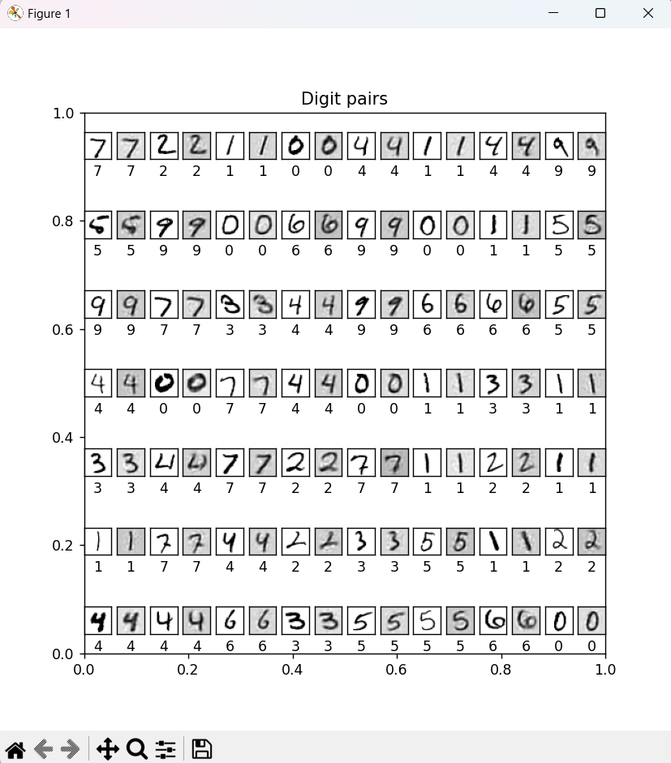
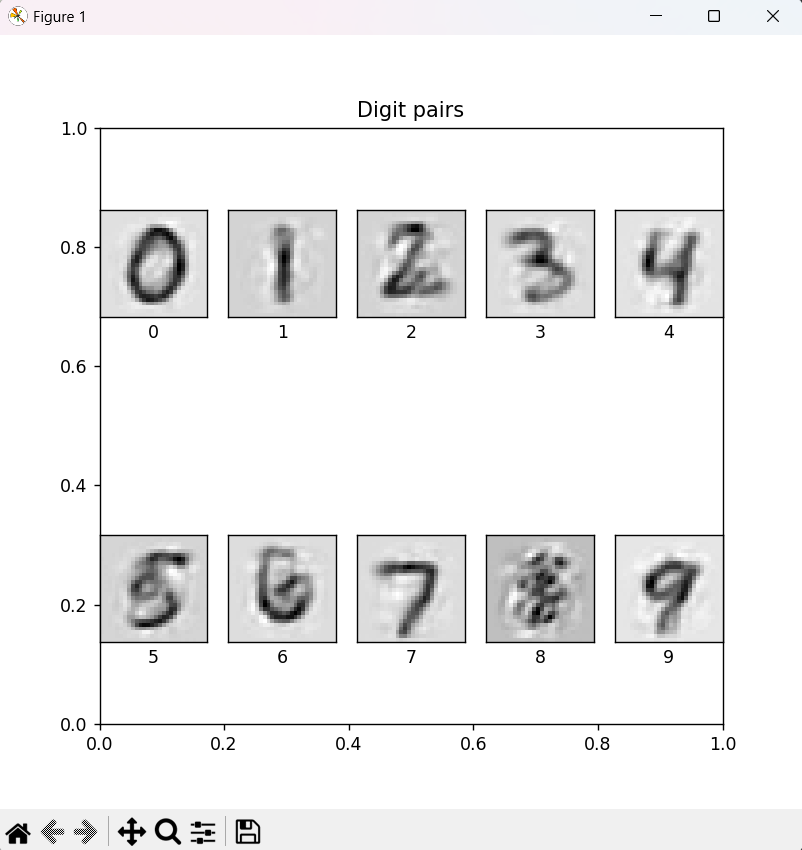

# AutoEncoder - MNIST 이미지 압축 및 복원

이 프로젝트는 AutoEncoder 모델을 구현하여 MNIST 손글씨 숫자 이미지를 압축하고 복원하는 딥러닝 실습입니다. AutoEncoder는 입력 데이터를 저차원 공간으로 압축한 뒤, 이를 다시 고차원 공간으로 복원하는 비지도 학습 모델입니다.

## 사용 기술
- Python
- TensorFlow / Keras
- NumPy
- Matplotlib

## 모델 구조
- 입력층: 784차원 (28x28 이미지)
- 인코더:
  - Dense(200), ReLU
  - Dense(200), ReLU
  - Dense(32), tanh
- 디코더:
  - Dense(200), ReLU
  - Dense(200), ReLU
  - Dense(784), Linear

## 파일 설명
- `AutoEncoder.py`: AutoEncoder 클래스 정의 (Encoder, Decoder, 전체 모델 구성)
- `MNISTData.py`: MNIST 데이터 로딩 및 시각화 함수
- `main.py`: 모델 학습 실행 스크립트
- `main_test.py`: 학습된 모델 로드 및 테스트 결과 시각화
- `model/ae_model.weights.h5`: 저장된 모델 가중치
- `results/`: 복원 이미지 및 평균 복원 이미지 저장

## 결과

### 원본 이미지와 복원 이미지 비교
아래 이미지는 테스트 데이터의 입력 이미지(위)와 AutoEncoder를 통해 복원된 이미지(아래)를 비교한 결과입니다.



### 숫자별 평균 Code 기반 복원 이미지
각 숫자 클래스별로 Code의 평균을 구한 뒤, Decoder에 입력해 복원한 이미지입니다.



### 1. 라이브러리 설치
```bash
pip install tensorflow numpy matplotlib
