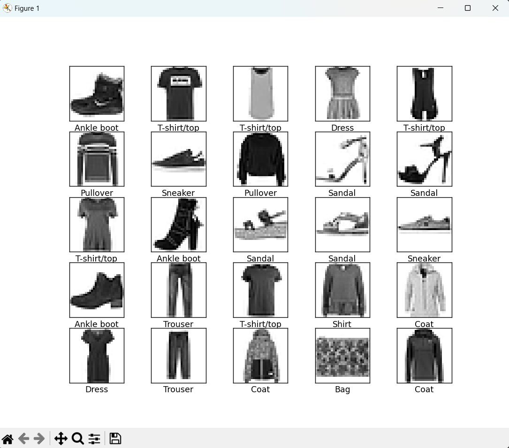

# CNN (Convolutional Neural Network) 실습

## 개요
CNN을 활용해 이미지 분류 모델을 구현했습니다.  
MNIST 또는 CIFAR-10 데이터셋을 기반으로 합성곱 신경망 구조를 실습했습니다.

## 사용 기술
- Python
- TensorFlow / Keras
- Conv2D, MaxPooling2D, Flatten, Dense

## 모델 구조 예시
Conv2D(32) → ReLU → MaxPooling  
Conv2D(64) → ReLU → MaxPooling  
Flatten → Dense(128) → Softmax

## 실행 방법
```bash
python main.py
```

## 실행 결과



